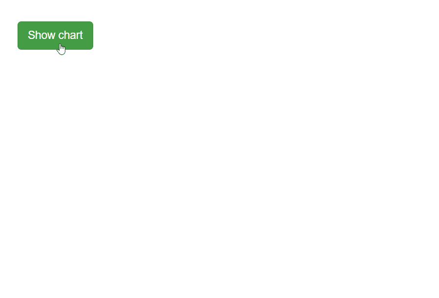
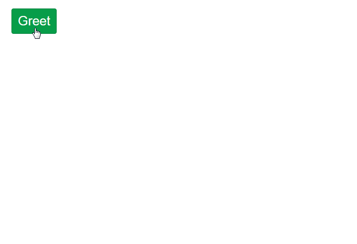

<h3 align="center">shinyalert</h3>
<h4 align="center">
  🗯️ Easily create pretty popup messages (modals) in Shiny
  <br><br>
  <a href="https://daattali.com/shiny/shinyalert-demo/">Demo</a>
  &middot;
  by <a href="https://deanattali.com">Dean Attali</a>
</h4>

<p align="center">
  <a href="https://github.com/daattali/shinyalert/actions">
    
  </a> 
  <a href="https://cran.r-project.org/package=shinyalert">
    
  </a>
</p>

---


{shinyalert} lets you easily create pretty popup messages (modals) in Shiny.

Modals can contain text, images, OK/Cancel buttons, Shiny inputs, and Shiny outputs (such as plots and tables). A modal can also have a timer to close automatically, and you can specify custom code to run when a modal closes. See the [demo Shiny app](https://daattali.com/shiny/shinyalert-demo/) online for examples.

**Need Shiny help? [I'm available for consulting](https://attalitech.com/).**<br/>
**If you find {shinyalert} useful, please consider [supporting my work](https://github.com/sponsors/daattali)! ❤**

<p align="center">
  <a style="display: inline-block;" href="https://github.com/sponsors/daattali">
    
  </a>
  <a style="display: inline-block;" href="https://paypal.me/daattali">
    
  </a>
</p>

> This package is part of a larger ecosystem of packages with a shared vision: solving common Shiny issues and improving Shiny apps with minimal effort, minimal code changes, and clear documentation. Other packages for your Shiny apps:

| Package | Description | Demo |
|---|---|---|
| [shinyjs](https://deanattali.com/shinyjs/) | 💡 Easily improve the user experience of your Shiny apps in seconds | [🔗](https://deanattali.com/shinyjs/overview#demo) |
| [shinyscreenshot](https://github.com/daattali/shinyscreenshot/) | 📷 Capture screenshots of entire pages or parts of pages in Shiny apps | [🔗](https://daattali.com/shiny/shinyscreenshot-demo/) |
| [timevis](https://github.com/daattali/timevis/) | 📅 Create interactive timeline visualizations in R | [🔗](https://daattali.com/shiny/timevis-demo/) |
| [shinycssloaders](https://github.com/daattali/shinycssloaders/) | ⌛ Add loading animations to a Shiny output while it's recalculating | [🔗](https://daattali.com/shiny/shinycssloaders-demo/) |
| [colourpicker](https://github.com/daattali/colourpicker/) | 🎨 A colour picker tool for Shiny and for selecting colours in plots | [🔗](https://daattali.com/shiny/colourInput/) |
| [shinybrowser](https://github.com/daattali/shinybrowser/) | 🌐 Find out information about a user's web browser in Shiny apps | [🔗](https://daattali.com/shiny/shinybrowser-demo/) |
| [shinydisconnect](https://github.com/daattali/shinydisconnect/) | 🔌 Show a nice message when a Shiny app disconnects or errors | [🔗](https://daattali.com/shiny/shinydisconnect-demo/) |
| [shinytip](https://github.com/daattali/shinytip/) | 💬 Simple flexible tooltips for Shiny apps | WIP |
| [shinymixpanel](https://github.com/daattali/shinymixpanel/) | 🔍 Track user interactions with Mixpanel in Shiny apps or R scripts | WIP |
| [shinyforms](https://github.com/daattali/shinyforms/) | 📝 Easily create questionnaire-type forms with Shiny | WIP |

# Table of contents

- [Examples](#examples)
- [Sponsors 🏆](#sponsors)
- [Overview](#overview)
- [Installation](#install)
- [Simple input modals](#input-modals)
- [Shiny inputs/outputs in modals](#shiny-tags)
- [Modal return value](#return-value)
- [Callbacks](#callbacks)
- [Chaining modals](#chaining)
- [Using in Rmarkdown files](#rmd)
- [Pre-loading the scripts](#useShinyalert)
- [Comparison with Shiny modals](#shiny-comparison)
- [Known issues](#known-issues)

<h2 id="examples">Examples</h2>

Example 1: [Simple modal](#overview)


Example 2: [Simple input modals](#input-modals)


Example 3: [Shiny inputs/outputs in modals](#shiny-tags)



Example 4: [Chaining modals](#chaining)



<h2 id="sponsors">Sponsors 🏆</h2>

> There are no sponsors yet

[Become the first sponsor for {shinyalert}!](https://github.com/sponsors/daattali/sponsorships?tier_id=39856)

<h2 id="overview">Overview</h2>

{shinyalert} uses the [sweetalert](https://github.com/t4t5/sweetalert) JavaScript library to create simple and elegant popups (modals) in Shiny.

Simply call `shinyalert()` with the desired arguments, such as a title and text, and a modal will show up. Here is a minimal Shiny app code that creates a modal:

```
library(shiny)
library(shinyalert)

ui <- fluidPage(
  actionButton("preview", "Preview")
)

server <- function(input, output, session) {
  observeEvent(input$preview, {
    # Show a modal when the button is pressed
    shinyalert("Oops!", "Something went wrong.", type = "error")
  })
}

shinyApp(ui, server)
```

<h2 id="install">Installation</h2>

**For most users:** To install the stable CRAN version:

```r
install.packages("shinyalert")
```

**For advanced users:** To install the latest development version from GitHub:

```r
install.packages("remotes")
remotes::install_github("daattali/shinyalert")
```

<h2 id="input-modals">Simple input modals</h2>

Usually the purpose of a modal is simply informative, to show some information to the user. However, the modal can also be used to retrieve an input from the user by setting the `type = "input"` parameter.

When using a `type="input"` modal, only a single input can be used. By default, the input will be a text input, but you can use other input types by specifying the `inputType` parameter (for example `inputType = "number"` will expose a numeric input).

<h2 id="shiny-tags">Shiny inputs/outputs in modals</h2>

While simple input modals are useful for retrieving input from the user, they aren't very flexible - they only allow one input. You can include any Shiny UI code in a modal, including Shiny inputs and outputs (such as plots), by providing Shiny tags in the `text` parameter and setting `html=TRUE`. For example, the following code would produce a modal with two inputs: 

```
shinyalert(html = TRUE, text = tagList(
  textInput("name", "What's your name?", "Dean"),
  numericInput("age", "How old are you?", 30),
))
```

<h2 id="return-value">Modal return value</h2>

Modals created with {shinyalert} have a return value when they exit.

When using a simple input modal (`type="input"`), the value of the modal is the value the user entered. Otherwise, the value of the modal is `TRUE` if the user clicked the "OK" button, and `FALSE` if the user dismissed the modal (either by clicking the "Cancel" button, using the Escape key, clicking outside the modal, or letting the `timer` run out).

The return value of the modal can be accessed via `input$shinyalert` (or using a different input ID if you specify the `inputId` parameter), as if it were a regular Shiny input. The return value can also be accessed using the *[modal callbacks](#callbacks)*.

<h2 id="callbacks">Callbacks</h2>

The return value of the modal is passed as an argument to the `callbackR` and `callbackJS` functions (if a `callbackR` or `callbackJS` arguments are provided). These functions get called (in R and in JavaScript, respectively) when the modal exits.

For example, using the following {shinyalert} code will result in a modal with an input field. After the user clicks "OK", a hello message will be printed to both the R console and in a native JavaScript alert box. You don't need to provide both callback functions, but in this example both are used for demonstration.

```
shinyalert(
  "Enter your name", type = "input",
  callbackR = function(x) { message("Hello ", x) },
  callbackJS = "function(x) { alert('Hello ' + x); }"
)
```

Notice that the `callbackR` function accepts R code, while the `callbackJS` function uses JavaScript code.

Since closing the modal with the Escape key results in a return value of `FALSE`, the callback functions can be modified to not print anything in that case.

```
shinyalert(
  "Enter your name", type = "input",
  callbackR = function(x) { if(x != FALSE) message("Hello ", x) },
  callbackJS = "function(x) { if (x !== false) { alert('Hello ' + x); } }"
)
```

<h2 id="chaining">Chaining modals</h2>

It's possible to chain modals (call multiple modals one after another) by making a `shinyalert()` call inside a {shinyalert} callback or using the return value of a previous modal. For example:

```
shinyalert(
  title = "What is your name?", type = "input",
  callbackR = function(value) { shinyalert(paste("Welcome", value)) }
)
```

<h2 id="rmd">Using in Rmarkdown files</h2>

You can use {shinyalert} in Rmarkdown documents as well. This only works in interactive Rmd documents (when `runtime: shiny` is used in the YAML).

````
---
output: html_document
runtime: shiny
---

```{r}
library(shinyalert)

textInput("name", "Name")
actionButton("button", "Click me")

observeEvent(input$button, {
  shinyalert(title = "Hey", text = input$name)
})
```
````

<h2 id="useShinyalert">Pre-loading the scripts</h2>

The first time a {shinyalert} message is shown, the required scripts are automatically inserted to the Shiny app. In real browsers (Chrome/Firefox/etc) this is not an issue, but in some contexts, such as inside RStudio's Viewer on some operating systems, this can sometimes cause the modal to appear glitchy for a brief moment until the scripts load.

If you notice this behaviour and prefer to pre-load the scripts when the Shiny app initializes, you can call `useShinyalert(force=TRUE)` anywhere in the UI. Note that calling `useShinyalert()` is NOT required.

<h2 id="shiny-comparison">Comparison with Shiny modals</h2>

Doesn't Shiny already have support for modals? 

Yes, it does.

And Shiny's modals are just fine.

I created {shinyalert} for two reasons: first of all, I started working on it well before Shiny had modals. But I decided to keep working on it and release it even afterwards because I find {shinyalert} to be easier to use and to result in much nicer modals. There are also some extra features in {shinyalert}, such as the callback functions and the timer. But ultimately it's a matter of convenience and aesthetics.

<h2 id="known-issues">Known issues</h2>

- Clicking any `<button>` tag inside a modal will close the modal. This is due to the underlying JavaScript library having this issue. This means that, for example, using radio buttons from {shinyWidgets} will cause this bug because their radio buttons are implemented using `<button>`.
- Chaining modals works fine when the modals contain only text, but when inputs or buttons are involved in chained modals, you may run into an issue such as [this one](https://github.com/daattali/shinyalert/issues/46) or [this one](https://github.com/daattali/shinyalert/issues/48).

<h2>Credits</h2>

Logo design by [Alfredo Hernández](https://aldomann.com/).
