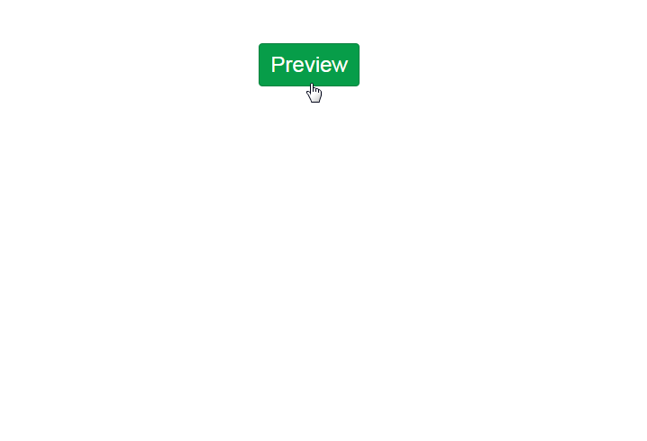
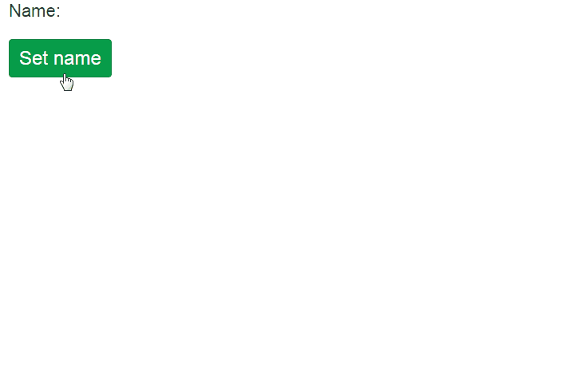

```{r setup, echo = FALSE, message = FALSE}
knitr::opts_chunk$set(tidy = FALSE, comment = "#>")
```

<p align="center">
<a href="https://github.com/daattali/shinyalert/">

</a>

<h3 align="center">shinyalert</h3>

<h4 align="center">Easily create pretty popup messages (modals) in Shiny
<br><br>
<a href="https://daattali.com/shiny/shinyalert-demo/">Demo</a>
&middot;
Copyright 2018
<a href="https://deanattali.com">Dean Attali</a>
</h4>

<p align="center">
<a href="https://www.paypal.me/daattali/20">

</a>
<a href="https://travis-ci.org/daattali/shinyalert">

</a>
<a href="https://cran.r-project.org/package=shinyalert">

</a>
</p>

</p>

---

`shinyalert` lets you easily create pretty popup messages (modals) in Shiny.

A modal can contain text, images, OK/Cancel buttons, an input to get a response from the user, and many more customizable options. The value of the modal can be retrieved in Shiny using an input or using callback functions. See the [demo Shiny app](https://daattali.com/shiny/shinyalert-demo/) online for examples.

**If you find shinyalert useful, please consider supporting my efforts developing open-source R packages!**

<p align="center">
  <a href="https://www.paypal.me/daattali/20">
    
  </a>
</p>

# Table of contents

- [Overview](#overview)
- [Installation](#install)
- [Input modals](#input-modals)
- [Modal return value](#return-value)
- [Callbacks](#callbacks)
- [Comparison with Shiny modals](#shiny-comparison)
- [Contributions](#contributions)

<h2 id="overview">Overview</h2>

`shinyalert` uses the [sweetalert](https://github.com/t4t5/sweetalert) JavaScript library to create simple and elegant popups (modals) in Shiny. Simply call `shinyalert()` with the desired arguments, such as a title and text, and a modal will show up.

In order to be able to call `shinyalert()` in a Shiny app, you must first call `useShinyalert()` anywhere in the app's UI.



Here is some minimal Shiny app code that creates the above modal:

```
library(shiny)
library(shinyalert)

ui <- fluidPage(
  useShinyalert(),  # Set up shinyalert
  actionButton("preview", "Preview")
)

server <- function(input, output, session) {
  observeEvent(input$preview, {
    # Show a modal when the button is pressed
    shinyalert("Oops!", "Something went wrong.", type = "error")
  })
}

shinyApp(ui, server)
```

It's also possible to ask the user to enter input in a modal.



The modal can also have a "Cancel" button, as well as many other customizable options.

<h2 id="install">Installation</h2>

To install the stable CRAN version:

```
install.packages("shinyalert")
```

To install the latest development version from GitHub:

```
install.packages("devtools")
devtools::install_github("daattali/shinyalert")
```

<h2 id="input-modals">Input modals</h2>

Usually the purpose of a modal is simply informative, to show some information to the user. However, the modal can also be used to retrieve an input from the user by setting the `type = "input"` parameter.

Only a single input can be used inside a modal. By default, the input will be a text input, but you can use other HTML input types by specifying the `inputType` parameter. For example, `inputType = "number"` will provide the user with a numeric input in the modal.

See the *[Modal return value](#return-value)* and *[Callbacks](#callbacks)* sections below for information on how to access the value entered by the user.

<h2 id="return-value">Modal return value</h2>

Modals created with `shinyalert` have a return value when they exit.

When there is an input field in the modal (`type="input"`), the value of the modal is the value the user entered. When there is no input field in the modal, the value of the modal is `TRUE` if the user clicked the "OK" button, and `FALSE` if the user clicked the "Cancel" button.

When the user exits the modal using the Escape key or by clicking outside of the modal, the return value is `FALSE` (as if the "Cancel" button was clicked). If the `timer` parameter is used and the modal closes automatically as a result of the timer, no value is returned from the modal.

The return value of the modal can be accessed via `input$shinyalert` in the Shiny server's code, as if it were a regular Shiny input. The return value can also be accessed using the *[modal callbacks](#callbacks)*.

<h2 id="callbacks">Callbacks</h2>

The return value of the modal is passed as an argument to the `callbackR` and `callbackJS` functions (if a `callbackR` or `callbackJS` arguments are provided). These are functions that get called, either in R or in JavaScript, when the modal exits.

For example, using the following `shinyalert` code will result in a modal with an input field. After the user clicks "OK", a hello message will be printed to both the R console and in a native JavaScript alert box. You don't need to provide both callback functions, but in this example both are used for demonstration.

```
shinyalert(
  "Enter your name", type = "input",
  callbackR = function(x) { message("Hello ", x) },
  callbackJS = "function(x) { alert('Hello ' + x); }"
)
```

Notice that the `callbackR` function accepts R code, while the `callbackJS` function uses JavaScript code.

Since closing the modal with the Escape key results in a return value of `FALSE`, the callback functions can be modified to not print hello in that case.

```
shinyalert(
  "Enter your name", type = "input",
  callbackR = function(x) { if(x != FALSE) message("Hello ", x) },
  callbackJS = "function(x) { if (x !== false) { alert('Hello ' + x); } }"
)
```

<h2 id="shiny-comparison">Comparison with Shiny modals</h2>

Doesn't Shiny already have support for modals? 

Yes, it does.

And Shiny's modals are more powerful in some ways than `shinyalert` modals. Shiny's native modals (using the `showModal()` and `modalDialog()` functions) can contain multiple input fields and even outputs.

I created `shinyalert` for two reasons: first of all, I started working on it before Shiny had modals. But I decided to keep working on it and release it even afterwards because I find `shinyalert` to be simpler to use and I think it results in much nicer modals. There are also some extra features in `shinyalert`, such as the callback functions and the timer. But ultimately it's a matter of convenience and aesthetics.

<h2 id="contributions">Contributions</h2>

If you have any suggestions or feedback, I would love to hear about it. You can either [message me directly](https://deanattali.com/contact), [open an issue](https://github.com/daattali/shinyjs/issues) if you want to request a feature/report a bug, or make a pull request if you can contribute.

Lastly, if you find shinyalert useful, please consider [supporting me](https://www.paypal.me/daattali/20) for the countless hours I've spent building, documenting, and supporting various open-source packages :)
